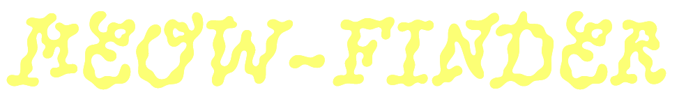

# meow-finder
Project 1 of edX Boot Camp (Front End) course to create an Interactive Front-End Application.

## Description

In Project 1 of the edX Boot Camp (Front End) course, our team was tasked with building an Interactive Front-End Application collaboratively.

**Our User Story**

"As a cat lover, I need an app that shows me different cat breeds with pictures and details, making it easy for me to help me choose the perfect cat for my household".

**Our Acceptance Criteria**

The application must

1. Present a range of cat breeds with clear pictures.
2. Include detailed breed information including characteristics.
3. Allow easy navigation for browsing different cat breeds.
4. Feature a search function for finding specific cat breeds.
5. Ensure accuracy and reliability of provided information.
6. Be accessible and user-friendly for cat lovers of all ages and backgrounds.

**Our Objectives**

1. Aim for the top grade
2. Group Effort
3. Motivate and support each other
4. Work together and enjoy the experience
5. Reach out to the team in case of any issues
6. Feel free to buddy up
7. Use Tech stack : HTML, CSS, Bootstrap, jQuery and Javascript

**About Us**

>‘Meow Finder’ is an app that integrates with ‘Cat API – Ninjas’ (https://api-ninjas.com) and ‘the Cat API’ (https://thecatapi.com/) to access a comprehensive database of cat breeds, images, and information. These two APIs provides a wealth of data on different cat breeds, and random information on cats allowing users to explore and discover their favourite furry friends. 

1.	Arvinder Anand (Tim) - Project Leader, Back-End Developer, and Quality Control Tester
2.	Elena Golovko - Front-End Developer and Quality Control Tester
3.	Adrianna Hollins - Front-End Developer and Quality Control Tester
4.	Oleksandr Khomych - Assistant Leader, Back-End Developer and Quality Control Tester
5.	Aniruddha Sridhar - Front-End Developer and Quality Control Tester

**FAQs**

>*What was our team's motivation?*

Our team was motivated by the learning experience working in a team and with the shared goal of enhancing our web development skills and achieving success in our careers.

>*Why we built this project?*

Building the website allowed us to bridge the gap between theoretical knowledge and practical application of Server Side API. It also helped consolidate our understanding of HTML, CSS, Bootstrap, Javascript and jQuery which we learned from Weeks 1 to 8. We choose to do it on the Cat theme as we also loved cats as well as we discovered two free and accessible WebAPIs to source data to our application.

>*What problem did this project solve?*

For cat lovers, it provides convenient access to a comprehensive database of cat breeds, images, and information. Explore detailed profiles of different breeds, including characteristics and personality, to help cat lovers find the perfect companion for their household.

>*What did we learn?*

We learned about how to plan for a successful development of an interactive front-end application.
Our objectives were initially laid out, conducted research into the APIs, coding standards, developed the skills for creating prototypes using wireframes. GitHub Project allowed issues to be raised (Story Points : Low, Medium and High) and assigned to various members of the team. Based on our issues raised, we followed AGILE Development principles by focussing on Minimum Viable Product (MVP) by delivering the most basic working application and then enhancing it. Daily Standup practice became a habit for us where each of us discussed what we had achieved in the last day, work to be done next and issues that were experienced in case someone else from the team could assist.

>Back End Team
Responsible for creating the back end logic, making use of available APIS ensuring they worked correctly and were integrated successfully, managing data storage and the performance of the system. It is pretty much everything behind the scenes to make the front end functional.

Front End Team
Focussed on designing prototypes of our logo and web page designs, building the user interface (UI) and user experience (UX) of the application. They are the lovely faces to Meow Finder!

Overall, we further built up our HTML, CSS, Bootstrap, Javascript and jQuery skills that we have learnt in the edX Online Bootcamp course.
Yes, it was hardwork, but we also learnt to have some fun too! All the above will have us to work successfully in a commercial environment.

> What makes my project stand out? 

It stands out as we have successfully completed the project with the uttermost quality. It shines all thanks to our dedication to top-notch design
adhering to exceptional project planning, design and programming practices.

We have applied the principles of Separation of Concern to the entire project and this includes assigning every person a separate task
and this includes separating the html, css, and javascript files. In the Javascript coding, we ensured that we each function did one thing
and did it well. The code is readable and maintainable. 

As a group, we pushed ourselves continually ensuring our work was of the highest quality.  

> Technologies Used

* HTML
* CSS
* Bootstrap
* Web API calls from NinjaAPI and TheCatAPI
* Javascript
* jQuery

> Tools Used

* Code Editors: Visual Studio Code and Visual Studio 2022
* Graphics: Figma to make wireframes and Adobe Illustrator for icons and logos
* Source Control: Git and GitHub
* Communications: Zoom Online Meetings, Slack, Email, Phone call, Whatsapp messages
* Browser: Microsoft Edge and Google Chrome

## Installation

The GitHub repository for our group project can be found at: 

https://github.com/timsbootcamp/meow-finder

The source code can be cloned from the above link. 

## Usage

Link to deployed site of our group project on Meow Finder
https://timsbootcamp.github.io/meow-finder/

## Screenshots of Meow Finder Application

>*Meow Finder Logo*

>*Home Page: 'index.html'*    

>*Search Page: 'search.html'*    

>Search Page: 'search.html' - user is able to select a particular cat breed name to search on*    

>*Catalogue Page: 'catalogue.html'*

>*Catalogue Page: 'catalogue.html' - user is able to select a particular cat breed name to search on*    

>*About Page: 'about.html'*    

## Screenshots of Design Wireframes

>*Wireframe for Home Page*   

>*Wireframe for Catalogue Page*   

## Documentation of Folders of our Project

'rootfolder' holds all html files

'assets/css/' holds all css files

'assets/documentation/' holds all documentation images files for readme

'assets/fonts/' holds all fonts for styling webpage

'assets/images/' holds all images 

## Other

>*Api usage of Ninja API for cats*   

## Credits

Ninja API for Cat Breed Information and Photos
https://api-ninjas.com/api/cats

TheCat API for Cat Fact and Photo
https://thecatapi.com/

Minutes meeting
https://www.vertex42.com/Files/download2/doc.php?file=meeting-minutes-detailed.docx

Meow sounds
https://pixabay.com/sound-effects/search/meow/

Favicon 
https://icons8.com/icons/set/cat

Font used for Logo
PicNic Regular by Velvetyne FR
